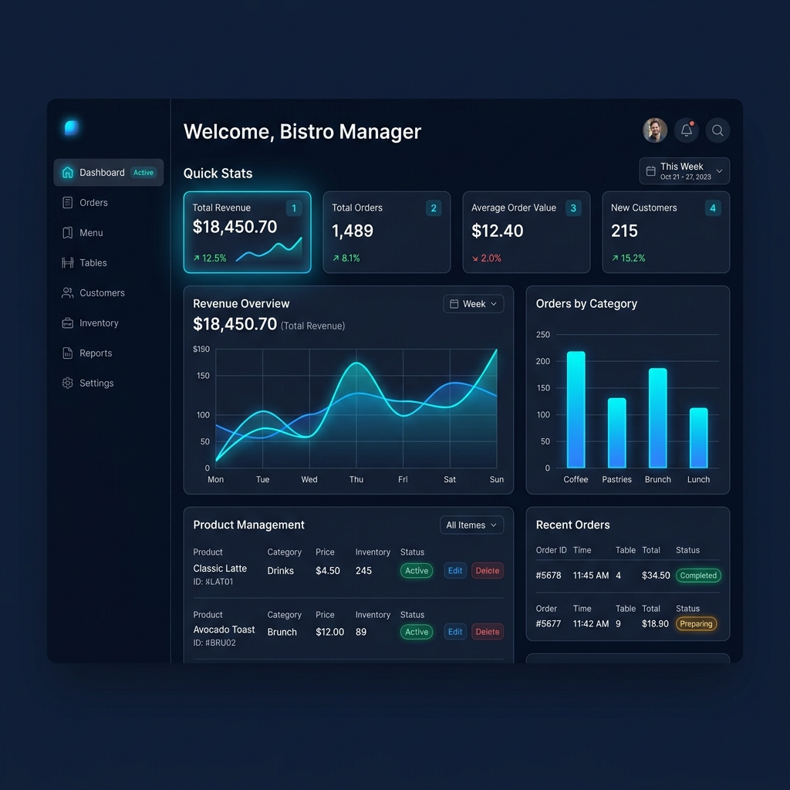

<div align="center">

# 🍽️ Kasir-AI

### Sistem Point of Sale Cerdas Berbasis AI

*Solusi POS modern untuk restoran & kafe — Full-Stack Monorepo dengan REST API, Admin Dashboard, dan Mobile App.*

[](https://expressjs.com/)
[](https://typescriptlang.org/)
[](https://react.dev/)
[](https://flutter.dev/)
[](https://mysql.com/)
[](https://orm.drizzle.team/)

<br/>



</div>

---

## 📋 Tentang Proyek

**Kasir-AI** adalah aplikasi Point of Sale (POS) lengkap yang dirancang khusus untuk bisnis F&B seperti restoran, kafe, dan warung makan. Dibangun dengan arsitektur monorepo full-stack yang mengintegrasikan tiga platform dalam satu ekosistem terpadu.

### ✨ Highlights

- 🏗️ **Monorepo Architecture** — 3 aplikasi dalam 1 repository menggunakan npm workspaces
- 🔐 **Role-Based Access** — Admin, Kasir, dan Dapur dengan UI khusus masing-masing
- 📊 **Real-time Analytics** — Dashboard dengan grafik penjualan, produk terlaris, dan laporan shift
- 🏪 **Multi-Cabang** — Kelola banyak lokasi bisnis dari satu sistem
- 🤖 **AI Insights** — Wawasan bisnis berbasis AI untuk optimasi operasional

---

## 🏛️ Arsitektur Sistem

```
kasir-ai/
├── apps/
│   ├── api/                  # 🖥️  Backend REST API
│   │   ├── src/
│   │   │   ├── routes/       # 14 route modules
│   │   │   ├── db/schema/    # 20 Drizzle ORM tables
│   │   │   ├── services/     # Business logic layer
│   │   │   ├── middleware/    # Auth, CORS, validation
│   │   │   └── lib/          # Auth & utilities
│   │   └── drizzle.config.ts
│   │
│   ├── admin/                # 💻 Admin Dashboard (Web)
│   │   └── src/
│   │       ├── pages/        # 14 page components
│   │       ├── components/   # 9 shared UI components
│   │       ├── hooks/        # Custom React hooks
│   │       └── services/     # API service layer
│   │
│   ├── mobile/               # 📱 Mobile App (Android)
│   │   └── lib/
│   │       ├── screens/      # 8 app screens
│   │       ├── providers/    # State management
│   │       ├── services/     # API integration
│   │       └── config/       # Theme & settings
│   │
│   └── portfolio/            # 🌐 Portfolio Landing Page
│       └── src/
│
└── package.json              # Monorepo workspace config
```

---

## 🛠️ Tech Stack

### Backend API
| Teknologi | Fungsi |
|-----------|--------|
| **Express.js** | Web framework untuk REST API |
| **TypeScript** | Type-safe JavaScript |
| **Drizzle ORM** | Type-safe database ORM |
| **MySQL** | Relational database |
| **Better Auth** | Authentication library |
| **Zod** | Schema validation |
| **Helmet** | Security headers |
| **Multer** | File upload handling |

### Admin Dashboard
| Teknologi | Fungsi |
|-----------|--------|
| **React 18** | UI component library |
| **Vite** | Build tool & dev server |
| **React Router** | Client-side routing |
| **Recharts** | Data visualization charts |
| **TailwindCSS** | Utility-first CSS |

### Mobile App
| Teknologi | Fungsi |
|-----------|--------|
| **Flutter** | Cross-platform UI framework |
| **Dart** | Programming language |
| **Provider** | State management |
| **Material 3** | Design system |
| **SharedPreferences** | Local storage |

---

## 📱 Fitur Utama

### 🛒 Point of Sale
- Antarmuka kasir dengan grid produk dan keranjang belanja
- Pencarian produk cepat dengan kategori filter
- Proses pembayaran multi-metode (tunai, QRIS, transfer)
- Perhitungan otomatis diskon, pajak, dan kembalian

### 📦 Manajemen Inventaris
- Tracking stok real-time per cabang
- Notifikasi stok kritis
- Penyesuaian stok dengan riwayat audit
- Bahan baku (ingredient) tracking per produk

### 👥 Manajemen Staf
- CRUD staf dengan role assignment
- Role: **Admin** (full access), **Kasir** (POS only), **Dapur** (kitchen display)
- Autentikasi aman dengan session management

### 🍳 Kitchen Display System
- Tampilan pesanan masuk real-time
- Update status pesanan (diproses → selesai)
- Interface khusus untuk staf dapur

### ⏰ Manajemen Shift
- Buka shift dengan modal awal
- Tutup shift dengan rekapitulasi otomatis
- Perhitungan selisih kas otomatis
- Riwayat shift per kasir

### 📊 Laporan & Analitik
- Grafik penjualan harian/mingguan/bulanan
- Produk terlaris dan kategori populer
- Laporan pendapatan per shift
- Export data transaksi

### 🏪 Multi-Cabang
- Kelola produk dan staf per cabang
- Produk bisa di-assign ke cabang tertentu
- Dashboard teragregasi lintas cabang

### 💰 Manajemen Pengeluaran
- Catat pengeluaran operasional harian
- Kategori pengeluaran custom
- Laporan pengeluaran periodik

---

## 🚀 Getting Started

### Prerequisites

- **Node.js** v18+
- **MySQL** 8.0+
- **Flutter SDK** 3.0+ (untuk mobile app)

### 1. Clone Repository

```bash
git clone https://github.com/KhemalMS/kasir-ai.git
cd kasir-ai
```

### 2. Setup Backend API

```bash
# Install dependencies
cd apps/api
npm install

# Setup environment
cp .env.example .env
# Edit .env dengan konfigurasi database MySQL kamu

# Push schema ke database
npm run db:push

# (Opsional) Seed data awal
npx tsx src/seed.ts

# Jalankan API server
npm run dev
```

### 3. Setup Admin Dashboard

```bash
cd apps/admin
npm install
npm run dev
# Buka http://localhost:5174
```

### 4. Setup Mobile App

```bash
cd apps/mobile
flutter pub get
flutter run
```

### 5. Jalankan Semua Sekaligus (Windows)

```bash
# Dari root directory
start.bat
```

---

## 📐 Database Schema

Kasir-AI menggunakan **20+ tabel relasional** dengan Drizzle ORM:

```
┌─────────────┐     ┌──────────────┐     ┌───────────────┐
│   products   │────▶│  orderItems   │◀────│    orders      │
│              │     │              │     │               │
│ - name       │     │ - quantity   │     │ - orderType   │
│ - price      │     │ - price      │     │ - status      │
│ - category   │     │ - subtotal   │     │ - tableNumber │
└──────┬───────┘     └──────────────┘     └───────┬───────┘
       │                                          │
       ▼                                          ▼
┌──────────────┐                          ┌───────────────┐
│  categories  │                          │   payments     │
│  variants    │                          │               │
│  ingredients │                          │ - method      │
│  branches    │                          │ - amount      │
└──────────────┘                          └───────────────┘

Tabel lainnya: staff, shifts, expenses, inventory,
stockAdjustments, settings, taxes, paymentMethods, branches
```

---

## 🔒 API Endpoints

| Method | Endpoint | Deskripsi |
|--------|----------|-----------|
| `POST` | `/api/auth/*` | Autentikasi (login/register/logout) |
| `GET/POST` | `/api/products` | CRUD produk |
| `GET/POST` | `/api/categories` | CRUD kategori |
| `GET/POST` | `/api/orders` | Manajemen pesanan |
| `GET/POST` | `/api/inventory` | Manajemen inventaris |
| `GET/POST` | `/api/staff` | Manajemen staf |
| `GET/POST` | `/api/shifts` | Buka/tutup shift |
| `GET/POST` | `/api/expenses` | Catat pengeluaran |
| `GET/POST` | `/api/branches` | Manajemen cabang |
| `GET` | `/api/reports` | Laporan & analitik |
| `GET` | `/api/kitchen` | Kitchen display feed |
| `GET/POST` | `/api/payments` | Metode pembayaran |
| `GET/POST` | `/api/settings` | Pengaturan toko |
| `POST` | `/api/upload` | Upload gambar produk |

---

## 📁 Statistik Proyek

| Metrik | Jumlah |
|--------|--------|
| 🗂️ Platform | 3 (API, Web, Mobile) |
| 🛣️ API Route Modules | 14 |
| 🗄️ Database Tables | 20+ |
| 📄 Admin Pages | 14 |
| 📱 Mobile Screens | 8 |
| 🧩 Shared Components | 9 |

---


## 🤝 Kontak

<div align="center">

Dibuat dengan ❤️ oleh **Khemal Sofian**

[](mailto:khemal.sofian08@gmail.com)
[](https://www.linkedin.com/in/khemalms)
[](https://github.com/KhemalMS)

</div>

---

<div align="center">

**⭐ Jika proyek ini bermanfaat, berikan star di GitHub! ⭐**

</div>
